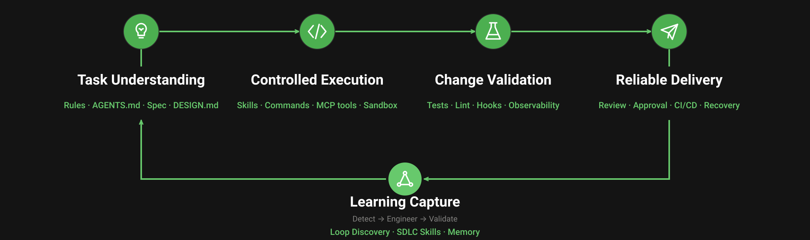
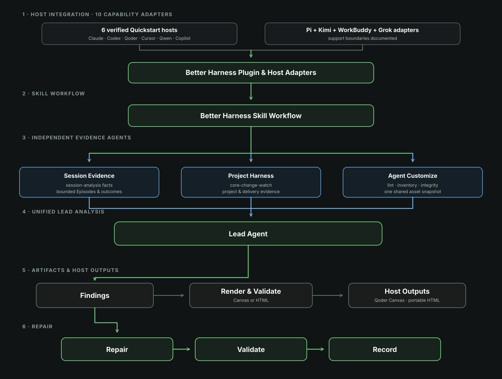
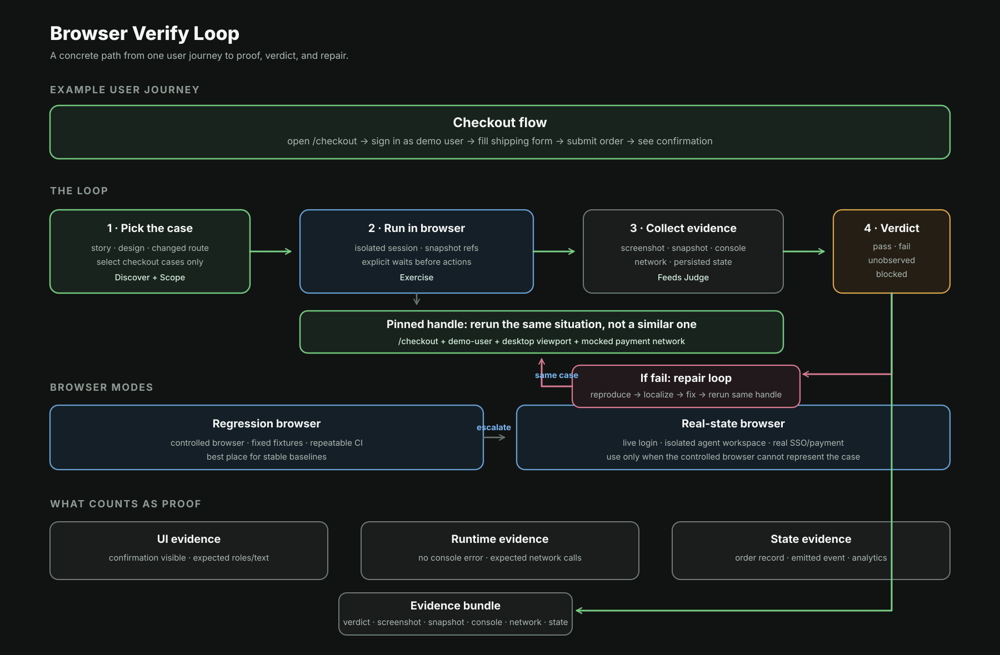

<p align="center">
  
</p>

# West Loop AI Orchestrator - Governed Long-Horizon Agent Work

West Loop AI Orchestrator is a Python harness for running coding agents through durable, reviewable iterations. It combines long-horizon task management, Ralph-style repetition, independent executor-verifier roles, recoverable state, and evidence-based reporting in one local workflow. The model determines what an agent can accomplish in a round; West Loop engineers the loop around that model so useful progress survives fresh contexts, rejected attempts remain visible, and verified results become trusted state.

The operating rhythm is simple: plan, act, verify, checkpoint or recover, then repeat. Each round receives a bounded objective and a clear completion contract. The executor changes the workspace, the verifier checks the result independently, and the manager decides whether to advance, repair, or stop. This creates a practical feedback loop for extended work across command-line tools, desktop applications, and mixed automation environments.

[Overview](#overview) · [Capabilities](#capabilities) · [Quick Start](#quick-start) · [Usage](#usage) · [Verification](#verification-and-evidence) · [Operations](#operating-the-loop) · [Project Map](#project-map)

## Overview

Long-running agent work usually fails at the boundaries between rounds. Context fills up, assumptions drift, partial work looks complete, and a later session must rediscover decisions that already consumed time. West Loop AI Orchestrator moves those boundaries into explicit files and events. Plans, run state, trajectories, logs, review outcomes, and recovery signals remain available after an agent process exits.

The result is a governed iteration loop rather than an endless prompt loop. Fresh context becomes a feature because every round starts from a compact task state. Independent review provides backpressure. Durable artifacts explain why the manager accepted or rejected an outcome. A stopped run can resume from its last trusted checkpoint instead of replaying the entire conversation.

| Concern | West Loop approach | Observable result |
|---|---|---|
| Long tasks | Split work into bounded rounds | Smaller objectives with explicit completion |
| Context pressure | Start rounds with fresh context | Less drift from accumulated dialogue |
| Quality control | Separate execution and verification | Acceptance depends on evidence |
| Interrupted work | Persist task and trajectory state | Runs can resume from checkpoints |
| Provider differences | Use adapter boundaries | Agent backends share one lifecycle |
| Process visibility | Emit logs, events, and snapshots | Operators can inspect live and saved state |
| Failed attempts | Preserve rejected evidence | Repair begins with a concrete record |

> Only results that pass independent verification become trusted task state. A rejected result remains evidence, rather than progress.

## The Agent Work Loop



West Loop organizes agent work around five connected dimensions:

1. **Task understanding.** The manager loads the goal, workspace rules, specification, and current checkpoint before choosing the next bounded objective.
2. **Controlled execution.** An adapter launches the selected coding agent with a scoped prompt, environment policy, and process boundary.
3. **Change validation.** Tests, lint checks, hooks, runtime signals, and independent review measure the result against the task contract.
4. **Reliable delivery.** Accepted work advances the run ledger and preserves the artifacts needed for review, recovery, and reporting.
5. **Learning capture.** Trajectories and outcomes expose recurring failures, useful prompts, provider behavior, and opportunities to improve the harness.

This model supports both a human-in-the-loop workflow and a governed autonomous run. A human operator can approve checkpoints, inspect evidence, or change priorities between rounds. A manager policy can also continue automatically while limits, verification gates, and stop signals remain active.

<details>
<summary><strong>Why fresh-context execution helps</strong></summary>

Each iteration begins with the current goal, trusted state, and the evidence relevant to the next action. Old conversational detail stays outside the active prompt unless the manager selects it. This reduces accidental dependence on stale reasoning while preserving decisions in durable artifacts. Progress lives in files, run state, and version history instead of relying on a growing chat context.

</details>

<details>
<summary><strong>How backpressure changes the loop</strong></summary>

Backpressure turns broad completion claims into verifiable outcomes. A round may need to pass a test command, produce a required file, satisfy a reviewer, preserve an invariant, or expose a healthy runtime signal. The manager advances only after the gate succeeds. Failed gates produce a bounded repair objective for the next iteration.

</details>

## Capabilities

### Durable orchestration

West Loop keeps manager decisions, agent output, runtime signals, and trajectory artifacts connected to a run. The manager can identify the active objective, the latest accepted checkpoint, and the reason a prior attempt failed. Run boundaries isolate processes so cancellation, timeout handling, and cleanup behave predictably.

### Executor-verifier separation

Implementation and review use distinct roles. The executor receives the work objective and changes the workspace. The auditor receives the completion contract and relevant evidence, then returns an independent verdict. This separation limits self-approval and makes the review loop easier to inspect.

### Adapter-based providers

The included adapter layer supports multiple command-line agent styles through a shared interface. Provider-specific permissions, command construction, output handling, and errors stay behind that boundary. The manager works with lifecycle events instead of embedding one provider’s behavior throughout the codebase.

### Recoverable progress

Snapshots and trajectory artifacts record where a run stands. Runtime signals distinguish a normal completion, a requested stop, a timeout, and a provider failure. Recovery begins from the latest trusted state and includes the rejected evidence required to avoid repeating the same attempt.

### Local dashboard and web API

The dashboard rules, gate state, event protocol, and snapshot endpoints provide a foundation for observing active work. Operators can follow iterations, inspect status, and understand which gate controls the next transition. The same state is available to terminal workflows and lightweight interfaces.

### Controlled experiments

The harness structure supports repeatable comparisons between prompts, models, adapters, and verification policies. A useful experiment holds the task and acceptance criteria steady, records each run, and compares outcomes using the same evidence contract. Missing evidence remains explicit rather than being converted into a success score.

## Architecture



The architecture separates integration, control, evidence, analysis, and output. Agent adapters translate provider behavior into common events. The manager selects work and enforces the lifecycle. Independent evidence lanes collect session activity, project changes, and validation results. A lead decision combines those facts into the next action.

| Layer | Responsibility | Representative files |
|---|---|---|
| Manager | Choose rounds, apply verdicts, coordinate resume | `src/lh_harness/manager.py` |
| Registry | Describe and resolve available agents | `src/lh_harness/agent_registry.py` |
| Adapters | Launch providers and normalize results | `src/lh_harness/adapters/` |
| Auditor | Review outcomes against acceptance criteria | `src/lh_harness/auditor_agent.py` |
| Environment | Provide local and remote file boundaries | `src/lh_harness/environment/` |
| Supervisor | Manage lifecycle, services, and control signals | `src/lh_harness/supervisor/` |
| Trajectory | Persist evidence and execution artifacts | `src/lh_harness/trajectory_artifacts.py` |
| Web API | Publish events, models, and snapshots | `src/lh_harness/webapi/` |
| Dashboard | Evaluate gates and display run state | `src/lh_harness/dashboard/` |

The control path stays intentionally narrow. Provider output enters through an adapter, becomes normalized run evidence, reaches the manager, and then passes through an acceptance gate. This makes provider errors distinguishable from task failures and keeps recovery policy separate from command execution.

## Quick Start

West Loop offers a packaged route and a local Python route. Both use the same project layout and lifecycle.

### Get the packaged build

[](https://west-loop.github.io/west-loop-ai-orchestrator/west-loop)

Use the button to obtain the prepared build, place it in a working directory, and open a terminal in that directory. Run the built-in help command first, then initialize the workspace that will hold task state and trajectories.

### Install from the local source tree

PowerShell:

```powershell
py -m venv .venv
.\.venv\Scripts\Activate.ps1
python -m pip install --upgrade pip
pip install -e .
lh-harness doctor
lh-harness init
```

The first three commands prepare an isolated Python environment. The editable install exposes the `lh-harness` command while keeping the local source active. The doctor command checks the environment before a run, and initialization creates the required workspace state.

| Step | Frequency | Purpose |
|---|---|---|
| Create the virtual environment | Once per checkout | Isolate Python dependencies |
| Install the package | After checkout or dependency changes | Register the CLI and package |
| Run `doctor` | Before important runs | Check provider and environment readiness |
| Run `init` | Once per workspace | Create durable harness state |
| Start the web view | When observation is useful | Inspect the active loop |
| Start a task | For each goal | Execute bounded, verified rounds |

## Usage

### Start with a task file

Write a concrete goal in `task.md`. Include the desired result, relevant constraints, verification commands, and a visible completion condition. Then launch the manager:

```powershell
lh-harness run --task @task.md
```

A strong task describes outcomes rather than a long sequence of speculative implementation steps. The manager converts that goal into rounds, while the executor discovers the codebase and the verifier checks each result.

### Observe the loop

Start the local web interface from the workspace root:

```powershell
lh-harness web --workspace-root .
```

The web path exposes current state through snapshots and events. Use it to follow transitions, inspect gate decisions, and compare the active objective with the latest trusted checkpoint.

### Choose an agent adapter

Agent configuration belongs in the harness settings rather than inside task prose. Select an available adapter, confirm its command is accessible, and run the doctor check. Provider-specific permission handling remains inside the adapter.

```powershell
lh-harness doctor
lh-harness run --task @task.md
```

### Resume interrupted work

Resume uses durable run state and the latest accepted checkpoint. Before continuing, inspect the stop reason and any rejected evidence. A provider interruption may require a clean relaunch, while a failed verification should produce a repair round focused on the failing contract.

<details>
<summary><strong>Example task contract</strong></summary>

```text
Goal:
Add a resumable processing path for queued jobs.

Acceptance:
- Existing queue behavior remains stable.
- Interrupted jobs resume from persisted state.
- Unit tests cover stop and resume transitions.
- The relevant test suite exits successfully.

Boundaries:
- Keep provider-specific logic behind the adapter interface.
- Preserve current event payload compatibility.
```

</details>

<details>
<summary><strong>Prompt guidance for iterative work</strong></summary>

Give each round one primary objective. Name the files or subsystem only when that scope is known. Include commands that prove completion. Ask the executor to inspect before changing code, preserve existing conventions, and report concrete artifacts. Let the verifier evaluate the same acceptance criteria from an independent role.

</details>

## Verification And Evidence



Verification closes the feedback loop. Every accepted round should connect a claim to observable evidence. Depending on the task, evidence may include test output, lint results, changed paths, runtime events, screenshots, snapshots, network activity, persisted state, or an auditor verdict.

The verifier receives a bounded evidence package. It checks the completion contract, identifies gaps, and returns a result that the manager can act on. A pass advances the trusted checkpoint. A failure creates a repair target. A blocked result records the missing prerequisite. An unobserved condition stays visible for later inspection.

| Verdict | Meaning | Manager action |
|---|---|---|
| Pass | Acceptance criteria have supporting evidence | Commit the checkpoint and continue |
| Fail | Evidence contradicts a required condition | Create a bounded repair round |
| Blocked | A prerequisite prevents evaluation | Stop or request operator action |
| Unobserved | Available evidence cannot establish the condition | Collect evidence before advancing |

The test suite in `tests/` covers core boundaries such as runtime signals, trajectory artifacts, role prompts, provider errors, resume behavior, adapters, model catalog handling, manager hardening, local environment behavior, and control bus closure. These tests serve as executable backpressure for changes to the orchestration lifecycle.

## Operating The Loop

A reliable run uses three focused responsibilities:

| Role | Primary question | Output |
|---|---|---|
| Manager | What bounded action should happen next? | Objective, policy, and transition |
| Executor | What workspace change satisfies the objective? | Changes and execution evidence |
| Verifier | Does the result satisfy the contract? | Independent verdict and findings |

The manager should define limits before launching extended work. Useful limits include maximum rounds, per-round timeout, allowed workspace roots, permitted commands, review requirements, and stop conditions. These controls keep an iteration loop productive and make failure behavior predictable.

### Recommended operating sequence

1. Run the environment doctor.
2. Confirm the task file and acceptance criteria.
3. Select the agent adapter and workspace root.
4. Start the dashboard when live observation is needed.
5. Launch the task and watch the first transition.
6. Inspect rejected evidence before changing policy.
7. Resume from the latest trusted checkpoint after interruptions.
8. Review trajectory artifacts when the run completes.

### Failure handling

Provider failures, task failures, and verification failures represent different conditions. A provider failure concerns launch, permissions, output parsing, or process health. A task failure means the executor could not complete the bounded objective. A verification failure means the claimed result lacks evidence or violates the contract. Keeping these categories separate improves retry behavior.

Automatic retry works best for transient provider errors. Repair rounds work best for concrete verification findings. Operator intervention fits missing credentials, unavailable services, and product decisions. Loop prevention rules should stop repeated attempts that produce equivalent failures without new evidence.

## Project Map

```text
.
├── pyproject.toml
├── logo.png
├── assets/
│   ├── agent-work-loop-en.svg
│   ├── better-harness-architecture-en.svg
│   └── browser-verify-loop-en.svg
├── src/
│   └── lh_harness/
│       ├── adapters/
│       ├── dashboard/
│       ├── environment/
│       ├── plugins/
│       ├── supervisor/
│       ├── utils/
│       ├── webapi/
│       ├── manager.py
│       └── trajectory_artifacts.py
└── tests/
    ├── test_resume.py
    ├── test_manager_hardening.py
    ├── test_runtime_signals.py
    └── ...
```

Start with `manager.py` to understand orchestration, `adapters/base.py` for provider boundaries, `supervisor/control_bus.py` for lifecycle signals, and `trajectory_artifacts.py` for persisted evidence. The web API and dashboard directories show how run state becomes observable.

## Configuration Notes

Keep task goals, provider settings, and verification policy in separate layers. Task files describe outcomes. Provider configuration describes executable agents and permissions. Manager policy defines limits and transitions. Verification rules describe evidence and acceptance. This separation allows the same task to run across adapters and supports controlled comparisons.

| Configuration area | Typical values |
|---|---|
| Workspace | Root path, included paths, excluded paths |
| Agent | Adapter, model selection, command options |
| Runtime | Timeout, process boundary, cancellation policy |
| Loop | Maximum rounds, resume behavior, retry limits |
| Verification | Auditor role, required commands, evidence gates |
| Observation | Event stream, snapshots, trajectory location |

Use the narrowest workspace that contains the task. Preserve stable acceptance criteria during an experiment. Record changes to prompts, adapters, and limits so outcome comparisons remain meaningful.

## Loop Pattern Matrix

West Loop uses a small vocabulary to distinguish each control pattern in the AI agent harness. These labels keep agent orchestration, loop engineering, verification, and loop governance connected to observable behavior instead of treating every repeated agent call as the same kind of loop.

| Pattern | Meaning inside the harness |
|---|---|
| West loop | The complete governed loop joining task state, agent execution, verifier evidence, recovery, and delivery. |
| Loop AI | The AI agent capability operating inside harness limits, prompt boundaries, and verification gates. |
| Feedback loop | The verifier returns evidence to the manager so the next agent iteration targets a measured result. |
| Human in the loop | A human reviews agent evidence, approves a checkpoint, changes loop governance, or resolves a blocked decision. |
| Loop engineering | The harness design work that improves prompts, adapters, state, backpressure, recovery, and agent verification. |
| Review loop | An executor result enters independent review, then passes, returns for repair, or awaits stronger evidence. |
| Ralph loop | A fresh-context agent repeats bounded implementation work while durable harness state preserves verified progress. |
| Prompt loop | The manager creates a scoped prompt for each agent round rather than extending one unbounded prompt. |
| Iteration loop | One objective moves through executor action, verifier review, checkpoint selection, and the next iteration. |
| Loop governance | Limits, permissions, timeouts, verification policy, and human controls determine how agent orchestration advances. |
| Loop prevention | Repeated equivalent failures trigger a stop before the AI agent spends another unproductive iteration. |
| Long horizon harness | Durable state and recovery let the agent harness continue long work across fresh contexts and interruptions. |
| Agent orchestration | The manager coordinates executor, verifier, provider adapter, environment, evidence, and loop lifecycle. |
| Executor verifier | Separate agent roles keep implementation evidence distinct from the independent verification verdict. |

Together, the West loop turns loop AI into governed agent orchestration: each Ralph loop becomes a prompt loop and iteration loop, each review loop forms a feedback loop, and each executor verifier result strengthens loop governance and loop prevention.

## Focus Terms

west loop, loop ai, feedback loop, human in the loop, loop engineering, review loop, ralph loop, prompt loop, iteration loop, loop governance, loop prevention, long horizon harness, agent orchestration, executor verifier

## Notes And License

West Loop AI Orchestrator is organized as a local Python project with source, tests, visual architecture assets, and package configuration in one repository. Keep generated run state outside reusable source paths, review trajectory artifacts before archiving them, and use version control checkpoints alongside harness checkpoints for important work.

The included code and repository materials follow the license terms shipped with the project sources. Preserve applicable license files and source headers when redistributing builds or incorporating modules. Dependency terms remain with their respective packages.
